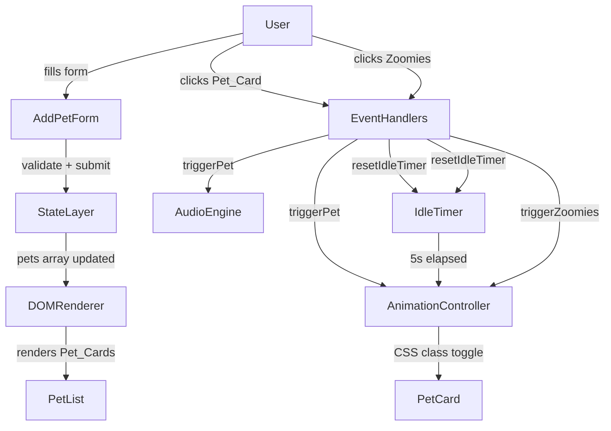

# Design Document: Virtual Pet App

## Overview

The Virtual Pet App is a single-page, browser-based web application built with plain HTML5, Tailwind CSS (CDN), and Vanilla JavaScript. It requires no build step, no server, and no external dependencies beyond the Tailwind CDN. Users can create virtual pets, view them in a card-based list, and interact with each pet through click-based actions that trigger animations and synthesized sound effects.

The design prioritizes simplicity and separation of concerns: a single `index.html` for markup, a `script.js` for all logic, and an optional `style.css` for custom keyframe animations that Tailwind cannot express inline. The entire application state lives in memory as a JavaScript array; there is no persistence layer.

### Key Design Decisions

- **No build step**: Tailwind is loaded via CDN. Custom animations are defined in `style.css` using `@keyframes`.
- **Web Audio API for sound**: All sound effects are synthesized programmatically — no audio files needed.
- **Animation locking**: Each Pet_Card tracks its own animation state to prevent stacking.
- **Idle timer per pet**: Each pet object owns its `setInterval` handle so timers can be reset independently.

---

## Architecture

The application follows a simple MVC-like structure within a single JavaScript file:

```
index.html          ← Static shell, Tailwind CDN, DOM entry points
style.css           ← @keyframes definitions (wiggle, float-up, fade-in, pet-click)
script.js
  ├── State Layer       ← pets[] array, pet data model
  ├── Audio Engine      ← AudioContext-based sound synthesis
  ├── Animation Controller ← CSS class toggling, idle timer management
  ├── DOM Renderer      ← renderPetList(), renderCounter(), renderEmptyState()
  └── Event Handlers    ← form submit, pet click, zoomies click
```



---

## Components and Interfaces

### 1. State Layer

Owns the canonical `pets` array. All mutations go through state functions.

```js
// pets array — single source of truth
let pets = [];

function addPet(name, type, age): Pet
function getPets(): Pet[]
function getPetById(id): Pet | undefined
```

### 2. Audio Engine

Synthesizes sound effects using the Web Audio API. Lazy-initializes `AudioContext` on first user gesture to comply with browser autoplay policies.

```js
function initAudioContext(): void          // called on first interaction
function playPopSound(): void              // short sine-wave blip
function playMeowSound(): void             // frequency-swept tone simulating meow
function playSoundForPet(petType): void    // dispatches to correct sound fn
```

**Sound synthesis approach:**
- `playPopSound`: Creates an `OscillatorNode` (sine, 440 Hz), short `GainNode` envelope (attack 0ms, decay 80ms), then disconnects.
- `playMeowSound`: Creates an `OscillatorNode` (sine), sweeps frequency from 600 Hz → 300 Hz over 200ms via `linearRampToValueAtTime`, then decays.

### 3. Animation Controller

Manages CSS class application and removal for all animations. Tracks per-card lock state to prevent stacking.

```js
function applyPetAnimation(cardEl): void      // scale-down + rotation, 300ms
function applyZoomiesAnimation(cardEl): void  // wiggle, 600ms
function applyFadeInAnimation(cardEl): void   // fade-in on card creation, 400ms
function showIdleEmoji(cardEl): void          // float-up 💤, 1.5s
function removeIdleEmoji(cardEl): void        // immediately removes 💤 element
function isAnimating(cardEl): boolean         // checks data-animating attribute
function lockAnimation(cardEl): void          // sets data-animating="true"
function unlockAnimation(cardEl): void        // removes data-animating attribute
```

Animation lock is stored as a `data-animating` attribute on the card element so it survives re-renders within the same DOM node.

### 4. Idle Timer

Each pet object holds a reference to its idle interval handle. The timer is managed alongside the pet's card element.

```js
function startIdleTimer(petId): void    // sets 5s timeout → starts 3s interval
function resetIdleTimer(petId): void    // clears existing timer, restarts
function clearIdleTimer(petId): void    // clears without restarting
```

### 5. DOM Renderer

Pure rendering functions — they read from `pets[]` and write to the DOM. They do not mutate state.

```js
function renderPetList(): void          // re-renders entire Pet_List
function renderPetCard(pet): HTMLElement // creates a single Pet_Card element
function renderCounter(): void          // updates Pet_Counter text
function renderEmptyState(): void       // shows/hides placeholder message
```

### 6. Add Pet Form Handler

Validates inputs and calls `addPet()` on success.

```js
function handleFormSubmit(event): void
function validateForm(name, type, age): ValidationResult
function showValidationErrors(errors): void
function clearValidationErrors(): void
```

### 7. Pet Type Emoji Map

```js
const PET_EMOJI = {
  cat:    '🐱',
  dog:    '🐶',
  rabbit: '🐰',
  fish:   '🐟',
  bird:   '🐦',
  other:  '🐾',
};
```

---

## Data Models

### Pet Object

```js
/**
 * @typedef {Object} Pet
 * @property {string}  id        - Unique identifier (crypto.randomUUID or Date.now string)
 * @property {string}  name      - Pet name, 1–50 characters
 * @property {string}  type      - Pet type (cat | dog | rabbit | fish | bird | other)
 * @property {number}  age       - Non-negative integer, 0–99
 * @property {number}  createdAt - Unix timestamp (ms) of creation
 * @property {number|null} idleTimerId   - setInterval handle for idle animation loop
 * @property {number|null} idleTimeoutId - setTimeout handle for initial 5s delay
 */
```

### ValidationResult Object

```js
/**
 * @typedef {Object} ValidationResult
 * @property {boolean}  valid   - true if all fields pass validation
 * @property {string[]} errors  - array of human-readable error messages
 */
```

### Animation State (DOM attribute)

Animation state is stored on the card element itself rather than in the pet object, to keep the data model free of UI concerns:

```
data-animating="true"   // set during pet-click or zoomies animation
data-pet-id="{id}"      // used to look up the pet object from a card element
```

---

## Correctness Properties

*A property is a characteristic or behavior that should hold true across all valid executions of a system — essentially, a formal statement about what the system should do. Properties serve as the bridge between human-readable specifications and machine-verifiable correctness guarantees.*

### Property 1: Valid pet addition grows the list

*For any* existing pet list state and any valid pet input (name 1–50 chars, non-empty type, age 0–99), calling `addPet` should result in the pets array length increasing by exactly one and the new pet being present in the array.

**Validates: Requirements 1.2, 2.3**

### Property 2: Invalid pet input is rejected

*For any* form input where at least one field is empty, or the name is outside 1–50 characters, or the age is outside [0, 99] or non-integer, `validateForm` should return `valid: false` with a non-empty errors array.

**Validates: Requirements 1.3, 1.5, 1.6**

### Property 3: Form resets after successful submission

*For any* valid pet input, after the form is successfully submitted, all form input fields should be empty or reset to their default state.

**Validates: Requirements 1.4**

### Property 4: Pet card renders all required fields and controls

*For any* valid pet object, the rendered Pet_Card HTML element should contain the pet's name, type, age, the emoji corresponding to its type, and a Zoomies button labeled with ⚡.

**Validates: Requirements 2.5, 5.1**

### Property 5: Pet counter matches list length

*For any* pets array of length N, the Pet_Counter text should equal `"N pet(s)"`.

**Validates: Requirements 2.2, 2.3**

### Property 6: Animation lock prevents stacking

*For any* Pet_Card that is currently animating (`data-animating="true"`), calling `applyPetAnimation` or `applyZoomiesAnimation` on that card should be a no-op — `isAnimating` continues to return true and no new animation class is applied.

**Validates: Requirements 3.5, 5.5**

### Property 7: Idle timer resets on interaction

*For any* pet with an active idle timer, triggering a pet-click or zoomies interaction should reset the timer such that the next idle animation fires no sooner than 5 seconds after the interaction, and any currently displayed 💤 emoji is immediately removed.

**Validates: Requirements 4.3, 4.4**

### Property 8: Sound dispatch correctness

*For any* pet type string, `playSoundForPet(petType)` should invoke `playMeowSound` if and only if `petType === 'cat'`, and `playPopSound` for all other type values.

**Validates: Requirements 3.2, 3.3**

---

## Error Handling

| Scenario | Handling |
|---|---|
| Form submitted with empty fields | Inline validation message per field; form not submitted |
| Name > 50 characters | Validation error; form not submitted |
| Age outside 0–99 or non-integer | Validation error; form not submitted |
| `AudioContext` not yet initialized | Lazy-init on first user gesture; no sound on very first page load before any interaction |
| Browser does not support Web Audio API | `try/catch` around `AudioContext` creation; audio silently disabled, all other features work |
| Browser does not support `crypto.randomUUID` | Fallback to `Date.now() + Math.random()` string for pet ID |

---

## Testing Strategy

### Unit Tests (example-based)

Focus on specific behaviors and edge cases:

- `validateForm` with empty name → returns `valid: false` with name error
- `validateForm` with name of exactly 50 chars → returns `valid: true`
- `validateForm` with name of 51 chars → returns `valid: false`
- `validateForm` with age = 0 → returns `valid: true`
- `validateForm` with age = 99 → returns `valid: true`
- `validateForm` with age = -1 → returns `valid: false`
- `validateForm` with age = 100 → returns `valid: false`
- `playSoundForPet('cat')` calls `playMeowSound`, not `playPopSound`
- `playSoundForPet('dog')` calls `playPopSound`, not `playMeowSound`
- `renderPetCard` for a cat pet includes '🐱' emoji
- Empty state message is shown when `pets` is empty; hidden when pets exist

### Property-Based Tests

Using [fast-check](https://github.com/dubzzz/fast-check) (JavaScript property-based testing library). Each test runs a minimum of 100 iterations.

**Property 1 — Valid pet addition grows the list**
```
// Feature: virtual-pet-app, Property 1: valid pet addition grows the list
fc.assert(fc.property(
  fc.array(validPetArb),   // arbitrary existing pets
  validPetInputArb,        // arbitrary valid new pet input
  (existingPets, newInput) => {
    const state = [...existingPets];
    addPetToState(state, newInput);
    return state.length === existingPets.length + 1;
  }
), { numRuns: 100 });
```

**Property 2 — Invalid pet input is rejected**
```
// Feature: virtual-pet-app, Property 2: invalid pet input is rejected
fc.assert(fc.property(
  invalidPetInputArb,   // arbitrary invalid input (empty field, bad age, long name)
  (input) => {
    const result = validateForm(input.name, input.type, input.age);
    return result.valid === false && result.errors.length > 0;
  }
), { numRuns: 100 });
```

**Property 3 — Pet counter matches list length**
```
// Feature: virtual-pet-app, Property 3: pet counter matches list length
fc.assert(fc.property(
  fc.array(validPetArb, { minLength: 0, maxLength: 20 }),
  (pets) => {
    const count = getPetCount(pets);
    return count === pets.length;
  }
), { numRuns: 100 });
```

**Property 4 — Pet card renders all required fields and controls**
```
// Feature: virtual-pet-app, Property 4: pet card renders all required fields and controls
fc.assert(fc.property(
  validPetArb,
  (pet) => {
    const card = renderPetCard(pet);
    const html = card.outerHTML;
    return html.includes(pet.name)
      && html.includes(pet.type)
      && html.includes(String(pet.age))
      && html.includes(PET_EMOJI[pet.type] ?? PET_EMOJI.other)
      && html.includes('⚡');   // Zoomies button
  }
), { numRuns: 100 });
```

**Property 6 — Animation lock prevents stacking**
```
// Feature: virtual-pet-app, Property 6: animation lock prevents stacking
fc.assert(fc.property(
  fc.boolean(),   // whether card starts locked
  (startLocked) => {
    const card = createMockCard();
    if (startLocked) lockAnimation(card);
    const wasAnimating = isAnimating(card);
    // attempting to apply animation when locked should be a no-op
    if (wasAnimating) {
      applyPetAnimation(card);  // should not change lock state
      return isAnimating(card) === true;
    }
    return true;
  }
), { numRuns: 100 });
```

**Property 8 — Sound dispatch correctness**
```
// Feature: virtual-pet-app, Property 8: sound dispatch correctness
fc.assert(fc.property(
  fc.constantFrom('cat', 'dog', 'rabbit', 'fish', 'bird', 'other'),
  (petType) => {
    const calls = trackSoundCalls(() => playSoundForPet(petType));
    if (petType === 'cat') {
      return calls.meow === 1 && calls.pop === 0;
    } else {
      return calls.pop === 1 && calls.meow === 0;
    }
  }
), { numRuns: 100 });
```

### Integration / Smoke Tests

- App loads in Chrome, Firefox, Safari, Edge without console errors
- Tailwind CDN link resolves and styles are applied
- Web Audio API is available and `AudioContext` initializes on first click
- Full user flow: add pet → see card → click card → hear sound → click zoomies → see wiggle
